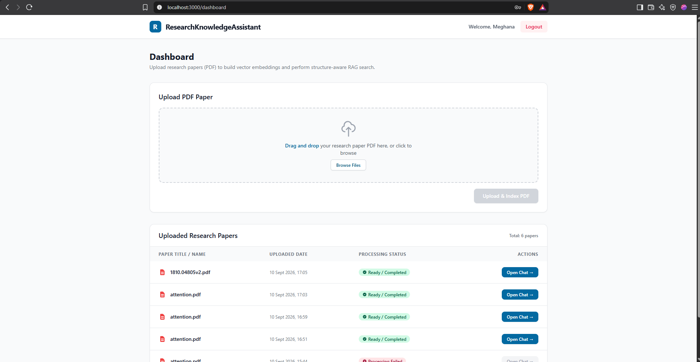
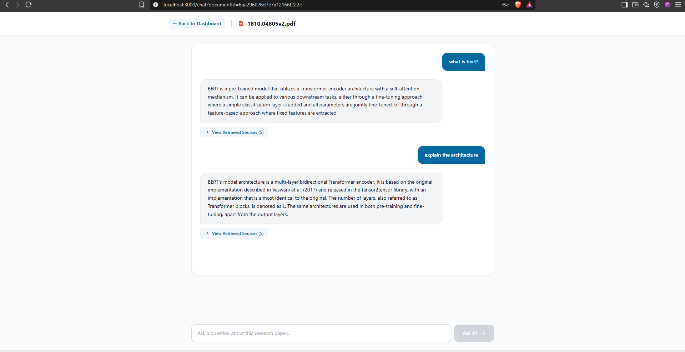
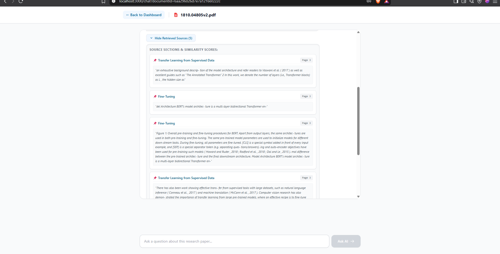

# 📚 Structure-Aware Research Paper Assistant

> An AI-powered full-stack RAG application that allows users to upload research papers, ask natural-language questions, and receive grounded answers based on the paper's content.


---

## 🎥 Demo

<!-- Add your demo GIF/video here -->


---

## 💡 What This Project Does

Research papers are often long and difficult to search manually. Traditional RAG systems can also lose important document structure when PDFs are split into arbitrary chunks.

This project uses **structure-aware RAG** to preserve sections such as:

```text
Abstract
Introduction
Methodology
Results
Discussion
Conclusion
```

Users can upload a paper and ask questions such as:

- What is the Transformer?
- What is the methodology used?
- How many encoder and decoder stacks are used?
- What is the conclusion of the paper?

The system retrieves relevant evidence and uses Gemini to generate a grounded answer.

---

## ✨ Key Features

- 🔐 JWT-based user authentication
- 📄 Research paper PDF upload
- 🧠 Structure-aware PDF parsing
- 🏷️ Heading and section detection
- ✂️ Structure-aware chunking
- 🔢 BGE embeddings
- ⚡ FAISS semantic search
- 🎯 Retrieval reranking
- 🛡️ Relevance gate for unsupported questions
- 🤖 Gemini-powered grounded answers
- 📚 Retrieved section/page information
- 💾 MongoDB document and chat persistence
- 🌐 React + Node.js + FastAPI architecture

---

## 🏗️ Architecture

```text
                    React + Vite
                         │
                         ▼
                  Node.js + Express
                    /           \
                   ▼             ▼
              MongoDB        FastAPI
                                 │
                                 ▼
                             PyMuPDF
                                 │
                                 ▼
                       Section Detection
                                 │
                                 ▼
                      Structure-Aware Chunking
                                 │
                                 ▼
                         BGE Embeddings
                                 │
                                 ▼
                              FAISS
                                 │
                                 ▼
                            Reranking
                                 │
                                 ▼
                         Relevance Gate
                                 │
                                 ▼
                        Google Gemini
                                 │
                                 ▼
                         Grounded Answer
```

---

## 🔄 How It Works

### Document Processing

```text
PDF
 ↓
PyMuPDF
 ↓
Heading Detection
 ↓
Section Detection
 ↓
Structure-Aware Chunking
 ↓
BGE Embeddings
 ↓
FAISS Index
```

### Question Answering

```text
Question
 ↓
BGE Query Embedding
 ↓
FAISS Retrieval
 ↓
Reranking
 ↓
Relevance Gate
 ↓
Gemini
 ↓
Grounded Answer + Sources
```

The relevance gate prevents unrelated questions from being unnecessarily passed to the LLM.

For example:

```text
Question:
"What is the population of India?"

If the paper does not contain the answer:

"I could not find the answer in the paper."
```

---

## 🛠️ Tech Stack

| Layer | Technologies |
|---|---|
| Frontend | React, Vite, Tailwind CSS, Axios |
| Backend | Node.js, Express.js, JWT, bcrypt, Multer |
| Database | MongoDB, Mongoose |
| AI Service | Python, FastAPI |
| PDF Processing | PyMuPDF |
| Embeddings | Sentence Transformers, BGE |
| Vector Search | FAISS |
| LLM | Google Gemini |

---

## 📁 Project Structure

```text
StructureAwareResearchPaperAssistant/
│
├── frontend/          # React + Vite application
│
├── backend/           # Node.js + Express API
│
├── ai_service/        # Python FastAPI + RAG pipeline
│   ├── core/
│   ├── retrieval/
│   ├── generation/
│   └── main.py
│
├── docs/              # Screenshots and demo
│
├── README.md
├── TECHNICAL_DOCUMENTATION.md
└── .gitignore
```

---

## ⚙️ Setup

### 1. Clone

```bash
git clone https://github.com/YOUR_USERNAME/StructureAwareResearchPaperAssistant.git
cd StructureAwareResearchPaperAssistant
```

### 2. Backend

```powershell
cd backend
npm install
npm run dev
```

Create `backend/.env`:

```env
PORT=5001
MONGO_URI=your_mongodb_connection_string
JWT_SECRET=your_jwt_secret
AI_SERVICE_URL=http://localhost:8001
```

### 3. AI Service

```powershell
cd ai_service
python -m venv venv
.\venv\Scripts\Activate.ps1
pip install -r requirements.txt
python -m uvicorn main:app --reload --port 8001
```

Create `ai_service/.env`:

```env
GEMINI_API_KEY=your_gemini_api_key
```

### 4. Frontend

```powershell
cd frontend
npm install
npm run dev
```

---

## 🧪 Example Queries

```text
What is the Transformer?

What is self-attention?

How many encoder and decoder stacks are used?

Summarize the methodology.

What is the conclusion of this paper?
```

---

## 📸 Screenshots

### Login


### Dashboard



### Chat



### Retrieved Sources



---

## 🚀 Future Improvements

- Hybrid BM25 + vector retrieval
- Cross-encoder reranking
- OCR for scanned PDFs
- Multimodal understanding of figures and tables
- Multi-document RAG
- Improved citation precision
- RAG evaluation and benchmarking

---

## 📖 Documentation

For detailed architecture, API design, RAG pipeline, database models, and implementation details, see:

**`TECHNICAL_DOCUMENTATION.md`**

---

## 👩‍💻 Author

### Meghana Sri Kondeti

B.Tech — Computer Science & Engineering

Interested in:

**AI/ML • Generative AI • NLP • RAG • Computer Vision • Full-Stack Development**

---

## ⭐ Project Highlight

> **Structure-aware document processing + semantic retrieval + relevance filtering + grounded LLM generation**

This project demonstrates how modern AI techniques can be combined with full-stack engineering to build a practical research assistant.
